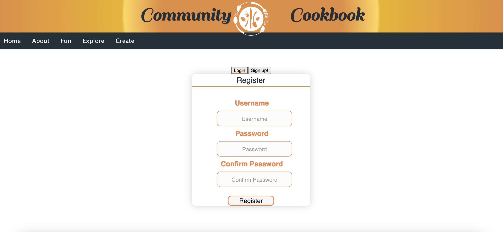
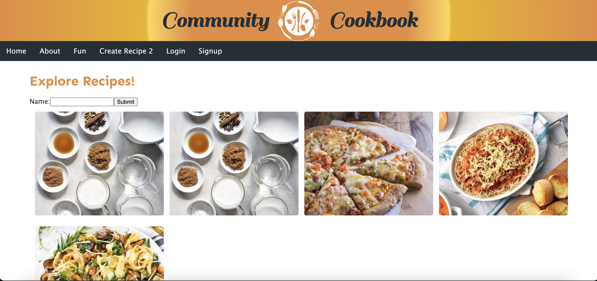
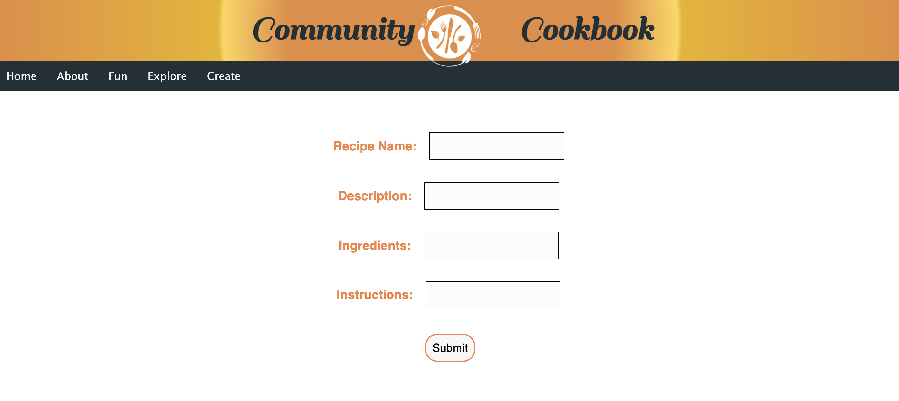

# Group_Project_3

## Name of the Project: Community cookbook ##

## Description: ##
We created this website to help others create connections with others in their community through food and to explore many interesting and unique recipes, 
because as the saying goes, the way to a person's heart, is through their stomach. Food is one of the many things we share between people, cultures, and 
countries. The Community Cookbook's goal is to bridge that distance and bring food to everyone, and create a safe space for people to share their favorite recipes!


## Motivation: ##
We're a rag-tag group of rookie programmers taking a bootcamp in order to better ourselves and the world. We have a passion for food and for our communities. We created this website to help others create connections with others in their community through food and to explore many interesting and unique recipes.

## Technologies used: ##
    * HTML
    * CSS
    * Visual Studio Code Editor
    * Javascript
    * NodeJS
    * ExpressJS
    * Heroku
    * Mysql
    * MongoDB
    * React
    * JWT
    * GraphQL
    
## Setup: ##
To run this project, install it locally by executing the following commands:

### Install ###
```
npm install

```
 ### Usage ###
 
```
npm run develop

```

## Website Screen Shots: ##







## Website Contents: ##

1. The header contains website title and navigation buttons, which navigates webpage to the associated pages.
2. The navigation bar contains the following sections:
     * Home
     * About
     * Fun
     * Explore
     * Create
3. The user can explore recipes.
4. About page contains creators story and thier favorite recipes.
5. User needs to signup and login to submit their recipes.
6. User can submit their recipes on create page.
7. Fun page offers a surprise to the user everytime they visit the page.

## Contributors: ##

* Peter Kingsley: https://github.com/pjkingsley

* Eric Anderson: https://github.com/ericdavidanderson

* Chelby Sallady: https://github.com/Sea-Chels

* Carlos Barajas

* Sara (Sarala K): https://github.com/sarasuni

## Live deployed link: 

https://vast-sierra-60049.herokuapp.com/create

https://github.com/pjkingsley/Group_Project_3


