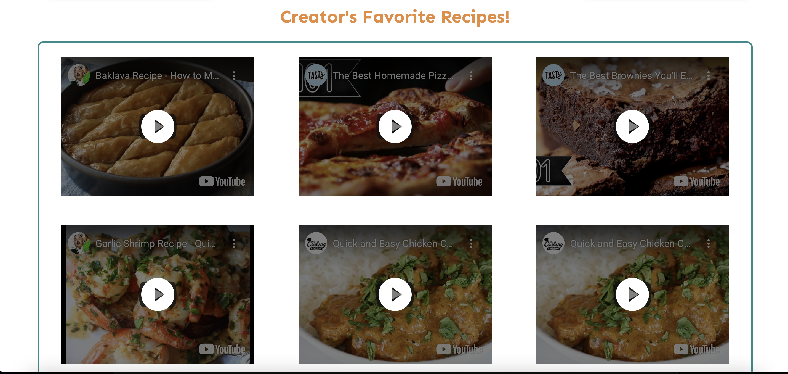

# Group_Project_3

## Name of the Project: Community cookbook ##

## Description: ##
A community forum to share recipes developed with a full MERN stack.

## Motivation: ##

## Technologies used: ##
    * HTML
    * CSS
    * Visual Studio Code Editor
    * Javascript
    * NodeJS
    * ExpressJS
    * Heroku
    * Mysql
    * MongoDB
    * React
    * JWT 

## Website Screen Shots: ##

## Website Contents: ##

## Live deployed link: 

## Contributors:

## Email:

